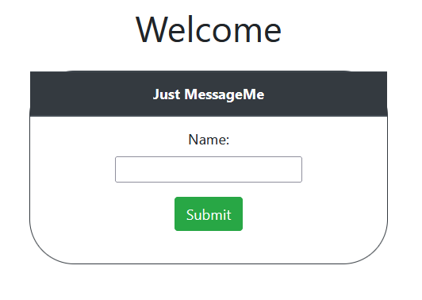
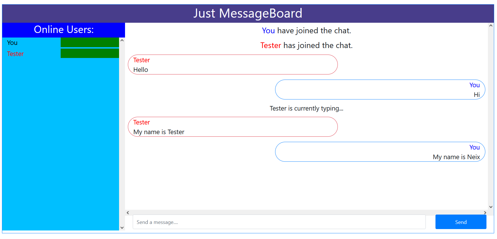
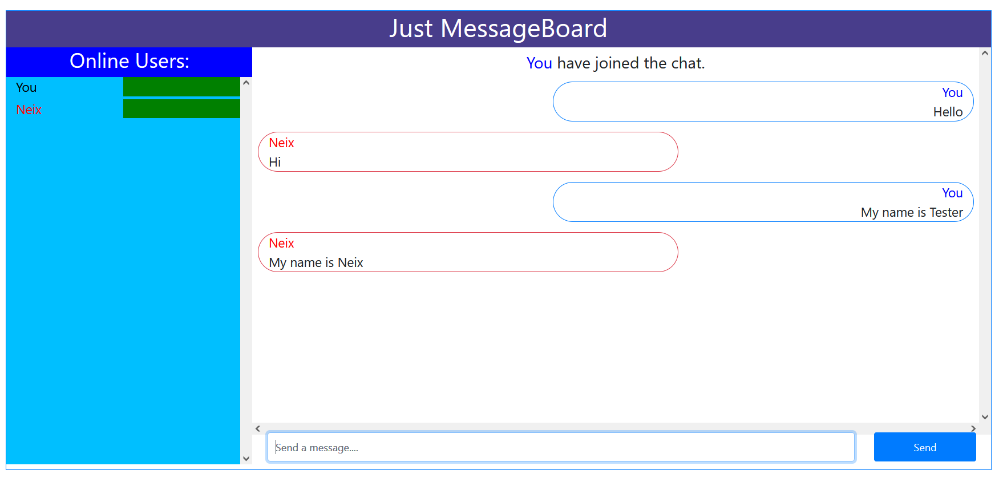

# Online Messenger Chat App
Made using Node JS, Express and Socket IO

## Libraries Used
* Bootstrap v4.5

## How to setup
1. Go to wwwroot folder and open the terminal
2. To download node modules, run `npm install`
3. To test run the server, run `npm run start` or `npm run dev`

## Demonstration
1. Homepage
   
2. Messaging - User View
   
3. Messaging - Client View
   
